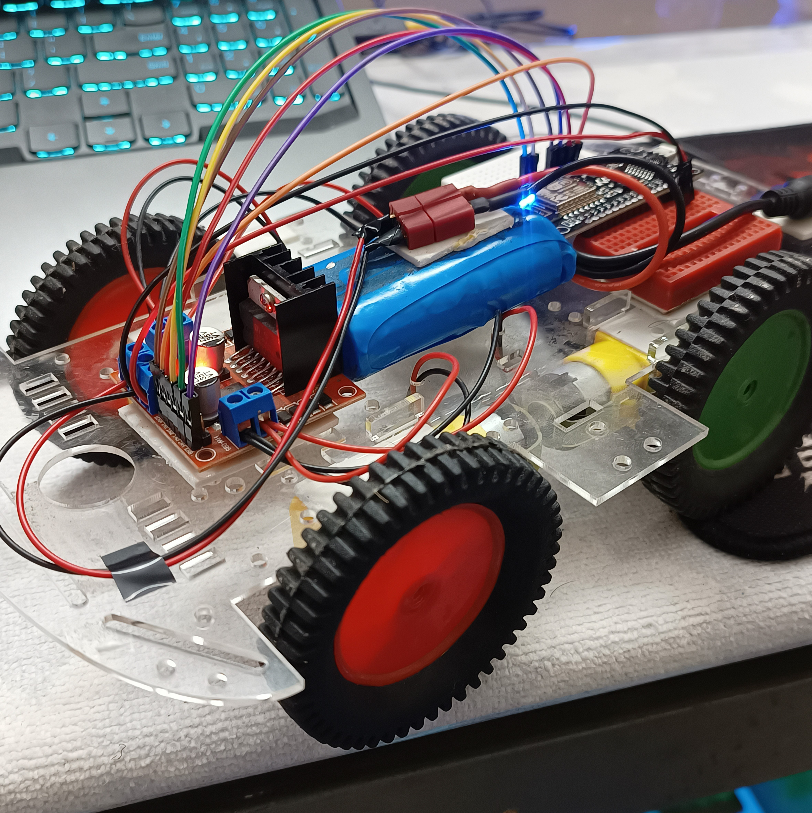
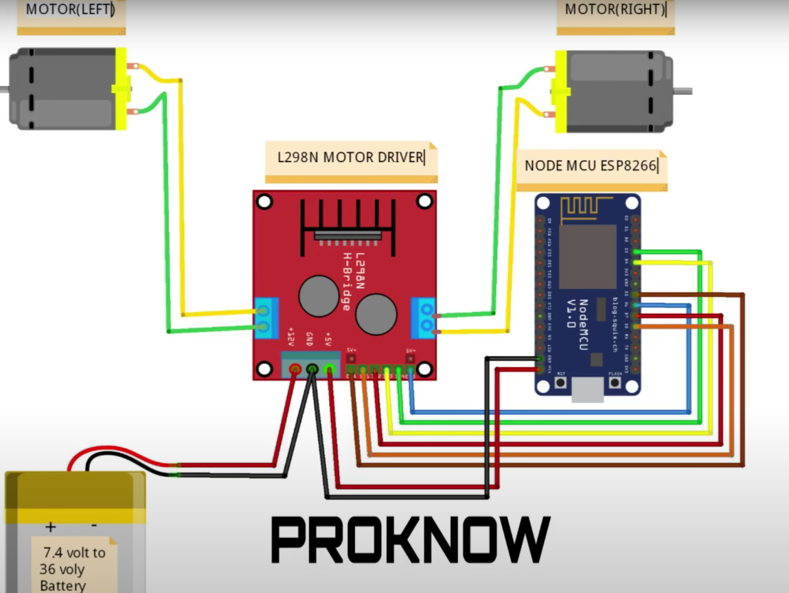

# 4-Wheeled Bot Project

## Description

This repository contains the code and documentation for a 4-wheeled car/bot project. The car is controlled wirelessly using an ESP32 microcontroller and can be driven using a mobile application. The project utilizes various hardware components, including an ESP32, 12V LiPo battery, L298N motor driver, jumper wires, DC motors, and a chassis.

## Hardware Used

- ESP32 microcontroller
- 12V LiPo battery
- L298N motor driver
- Jumper wires
- DC motors
- Chassis

## Wiring Diagram

Below is the wiring diagram for connecting the components:

## Code

The code for controlling the car/bot is written in Arduino IDE using C++. You can find the code in the `car_bot_code.ino` file in this repository.

### Code Features

- The `speedcar` variable allows you to vary the maximum speed of the car. Adjust this value to control the car's speed according to your requirements.
- The `speed_coeff` variable allows you to change the speed coefficient of the car. Modify this value to fine-tune the car's responsiveness to speed adjustments.
- The `ssid` variable can be changed to set the desired SSID for the car to establish a Wi-Fi connection.
- The `password` variable is used to secure the Wi-Fi connection with the specified SSID.

## Control Instructions

To control the car/bot:

1. Connect your phone wirelessly to the ESP32.
2. Launch the NodeMCU_car app on your phone.
3. Follow the instructions in the app to drive the car/bot.

## Usage

Please ensure that you have set up the hardware components correctly and uploaded the `car_bot_code.ino` file to the ESP32 using the Arduino IDE.

## Credits

Feel free to acknowledge any contributors or resources that helped you during the project.

## License

Feel free to modify the structure and content according to your project's specific details. Add any additional sections that you think might be relevant for your project's documentation.